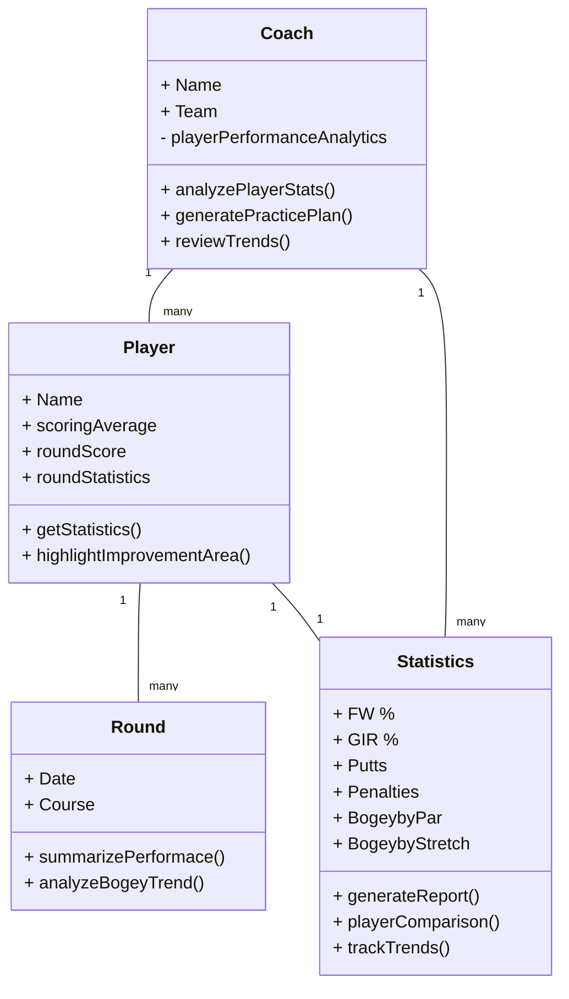
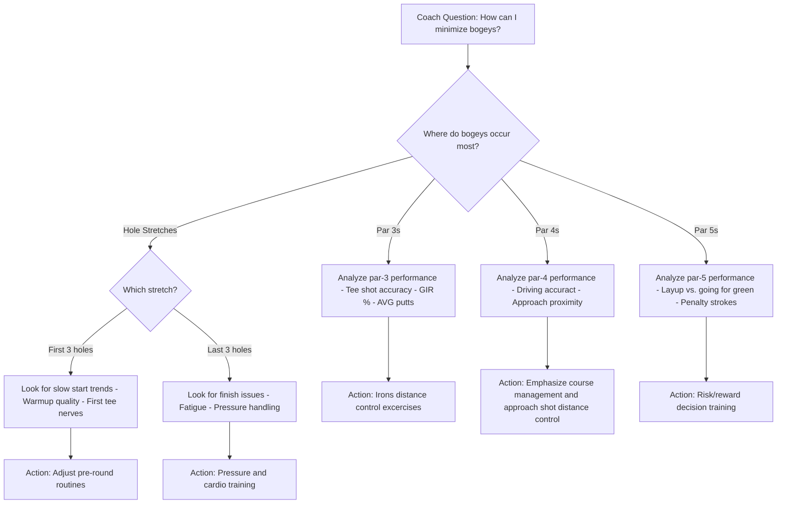
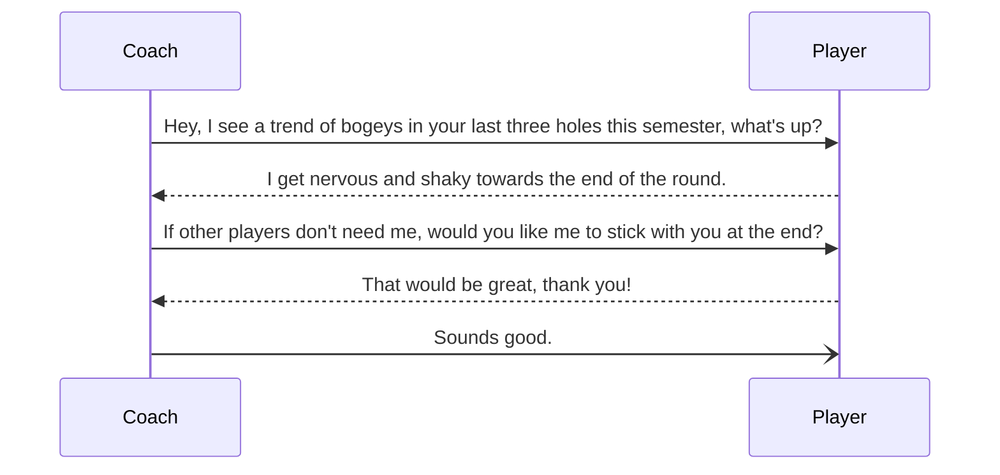
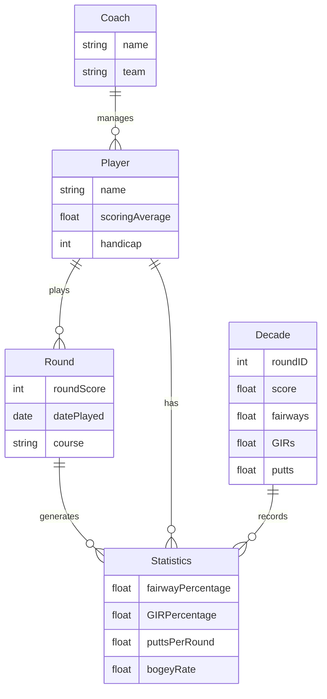

# Mermaid Diagrams

## Diagram 1: Class Diagram

```mermaid
classDiagram
  class Coach
  Coach : + Name
  Coach : + Team
  Coach : - playerPerformanceAnalytics
  Coach : + analyzePlayerStats()
  Coach : + generatePracticePlan()
  Coach : + reviewTrends()

  class Player
  Player : + Name
  Player : + scoringAverage
  Player : + roundScore
  Player : + roundStatistics
  Player : + getStatistics()
  Player : + highlightImprovementArea()

  class Round
  Round : + Date
  Round : + Course
  Round : + summarizePerformace()
  Round : + analyzeBogeyTrend()

  class Statistics
  Statistics : + FW %
  Statistics : + GIR %
  Statistics : + Putts
  Statistics : + Penalties
  Statistics : + BogeybyPar
  Statistics : + BogeybyStretch
  Statistics : + generateReport()
  Statistics : + playerComparison()
  Statistics : + trackTrends()

  Coach "1" -- "many" Player
  Player "1" -- "many" Round
  Player "1" -- "1" Statistics
  Coach "1" -- "many" Statistics
```

## Diagram 2: Flowchart Diagram

```mermaid
flowchart TD
  A[Coach Question: How can I minimize bogeys?] --> B{Where do bogeys occur most?}

  B -->|Par 3s| C[Analyze par-3 performance - Tee shot accuracy - GIR % - AVG putts]
  B -->|Par 4s| D[Analyze par-4 performance - Driving accuract - Approach proximity]
  B -->|Par 5s| E[Analyze par-5 performance - Layup vs. going for green - Penalty strokes]
  B -->|Hole Stretches| F{Which stretch?}

  F -->|First 3 holes| G[Look for slow start trends - Warmup quality - First tee nerves]
  F -->|Last 3 holes| H[Look for finish issues - Fatigue - Pressure handling]

  C --> I[Action: Irons distance control excercises]
  D --> J[Action: Emphasize course management and approach shot distance control]
  E --> K[Action: Risk/reward decision training]
  G --> L[Action: Adjust pre-round routines]
  H --> M[Action: Pressure and cardio training]
```

## Diagram 3: Sequence Diagram

```mermaid
sequenceDiagram
  Coach->>Player: Hey, I see a trend of bogeys in your last three holes this semester, what's up?
  Player-->>Coach: I get nervous and shaky towards the end of the round.
  Coach->>Player: If other players don't need me, would you like me to stick with you at the end?
  Player-->>Coach: That would be great, thank you!
  Coach-)Player: Sounds good.
```

## Diagram 4: ER Diagram

```mermaid
erDiagram
   direction TB

   Coach ||--o{ Player : manages
   Coach {
      string name
      string team
   }

   Player ||--o{ Round : plays
   Player {
      string name
      float scoringAverage
      int handicap
   }

   Round ||--o{ Statistics : generates
   Player ||--o{ Statistics : has
   Decade ||--o{ Statistics : records

   Round {
      int roundScore
      date datePlayed
      string course
   }
   
   Statistics {
      float fairwayPercentage
      float GIRPercentage
      float puttsPerRound
      float bogeyRate
   }

   Decade {
      int roundID
      float score
      float fairways
      float GIRs
      float putts
   }
```
